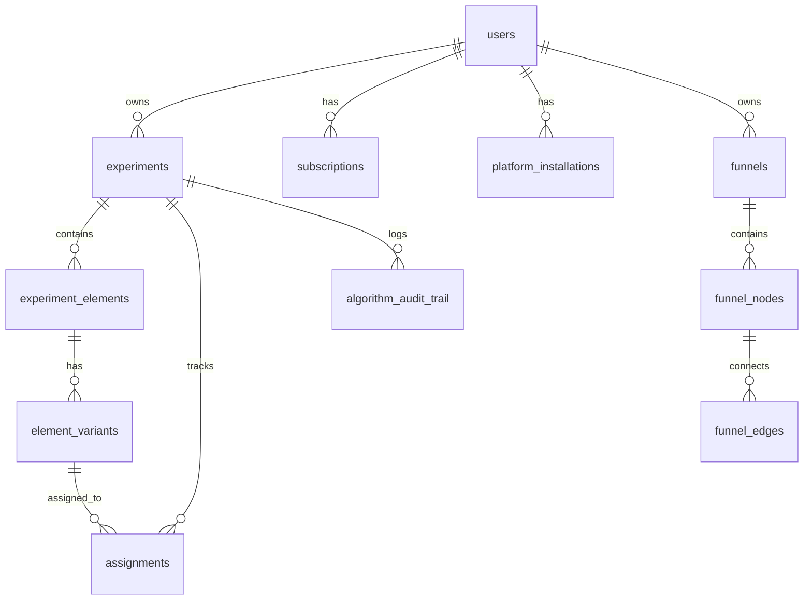

# 🗄️ Base de Datos

**Versión**: 1.0  
**Última actualización**: Diciembre 2024

---

## Overview

Samplit usa **PostgreSQL 13+** como base de datos principal, conectándose via **asyncpg** para operaciones asíncronas de alto rendimiento.

---

## Esquemas SQL

Los archivos de esquema se encuentran en `database/schema/`:

| Archivo | Contenido |
|---------|-----------|
| `schema_phase1_PRODUCTION_READY.sql` | Tablas principales (users, experiments, variants, assignments) |
| `schema_audit.sql` | Trail de auditoría con hash chain |
| `schema_leads.sql` | Captura de leads y onboarding |
| `schema_integrations_PRODUCTION_READY.sql` | OAuth tokens, instalaciones |
| `migration_01_add_roles.sql` | Roles de usuario |

---

## Tablas Principales

### users

```sql
CREATE TABLE users (
    id UUID PRIMARY KEY DEFAULT gen_random_uuid(),
    email VARCHAR(255) UNIQUE NOT NULL,
    password_hash VARCHAR(255) NOT NULL,
    name VARCHAR(255),
    company VARCHAR(255),
    role VARCHAR(50) DEFAULT 'client',  -- 'admin' | 'client'
    created_at TIMESTAMPTZ DEFAULT NOW(),
    updated_at TIMESTAMPTZ DEFAULT NOW()
);
```

### experiments

```sql
CREATE TABLE experiments (
    id UUID PRIMARY KEY DEFAULT gen_random_uuid(),
    user_id UUID REFERENCES users(id),
    name VARCHAR(255) NOT NULL,
    description TEXT,
    target_url VARCHAR(2048),
    status VARCHAR(50) DEFAULT 'draft',  -- draft|active|paused|completed|archived
    experiment_type VARCHAR(50) DEFAULT 'ab_test',  -- ab_test|multi_element
    traffic_allocation FLOAT DEFAULT 1.0,
    allocation_strategy VARCHAR(50) DEFAULT 'adaptive',  -- adaptive|fixed
    created_at TIMESTAMPTZ DEFAULT NOW(),
    started_at TIMESTAMPTZ,
    completed_at TIMESTAMPTZ,
    metadata JSONB DEFAULT '{}'
);
```

### experiment_elements

```sql
CREATE TABLE experiment_elements (
    id UUID PRIMARY KEY DEFAULT gen_random_uuid(),
    experiment_id UUID REFERENCES experiments(id) ON DELETE CASCADE,
    name VARCHAR(255) NOT NULL,
    selector_type VARCHAR(50),  -- css|xpath|id|class
    selector_value VARCHAR(1024),
    fallback_selectors JSONB DEFAULT '[]',
    element_type VARCHAR(50),  -- text|button|headline|image|link
    original_content JSONB,
    element_order INT DEFAULT 0,
    created_at TIMESTAMPTZ DEFAULT NOW()
);
```

### element_variants

```sql
CREATE TABLE element_variants (
    id UUID PRIMARY KEY DEFAULT gen_random_uuid(),
    element_id UUID REFERENCES experiment_elements(id) ON DELETE CASCADE,
    name VARCHAR(255) NOT NULL,
    content JSONB NOT NULL,
    is_control BOOLEAN DEFAULT FALSE,
    is_active BOOLEAN DEFAULT TRUE,
    algorithm_state TEXT,  -- Encrypted Bayesian state
    variant_order INT DEFAULT 0,
    
    -- Statistics
    total_allocations INT DEFAULT 0,
    total_conversions INT DEFAULT 0,
    conversion_rate FLOAT DEFAULT 0.0,
    
    created_at TIMESTAMPTZ DEFAULT NOW()
);
```

### assignments

```sql
CREATE TABLE assignments (
    id UUID PRIMARY KEY DEFAULT gen_random_uuid(),
    experiment_id UUID REFERENCES experiments(id),
    variant_id UUID REFERENCES element_variants(id),
    user_identifier VARCHAR(255) NOT NULL,  -- visitor_id/browser_id
    session_id VARCHAR(255),
    context JSONB DEFAULT '{}',  -- Device, browser, location
    
    assigned_at TIMESTAMPTZ DEFAULT NOW(),
    converted_at TIMESTAMPTZ,
    conversion_value FLOAT DEFAULT 1.0,
    metadata JSONB,
    
    UNIQUE(experiment_id, user_identifier)  -- Un usuario = una variante
);
```

---

## Tablas de Soporte

### algorithm_audit_trail

Trail de auditoría con integridad criptográfica:

```sql
CREATE TABLE algorithm_audit_trail (
    id UUID PRIMARY KEY DEFAULT gen_random_uuid(),
    experiment_id UUID REFERENCES experiments(id),
    sequence_number INT NOT NULL,
    
    -- Decision data
    decision_type VARCHAR(50),  -- assignment|conversion|reallocation
    decision_data JSONB NOT NULL,
    
    -- Hash chain integrity
    previous_hash VARCHAR(64),
    current_hash VARCHAR(64) NOT NULL,
    
    created_at TIMESTAMPTZ DEFAULT NOW(),
    
    UNIQUE(experiment_id, sequence_number)
);
```

### platform_installations

```sql
CREATE TABLE platform_installations (
    id UUID PRIMARY KEY DEFAULT gen_random_uuid(),
    user_id UUID REFERENCES users(id),
    platform VARCHAR(50),  -- shopify|wordpress|custom
    installation_token VARCHAR(255) UNIQUE,
    domain VARCHAR(255),
    status VARCHAR(50) DEFAULT 'active',
    oauth_data JSONB,
    created_at TIMESTAMPTZ DEFAULT NOW()
);
```

### funnels

```sql
CREATE TABLE funnels (
    id UUID PRIMARY KEY DEFAULT gen_random_uuid(),
    user_id UUID REFERENCES users(id),
    name VARCHAR(255) NOT NULL,
    description TEXT,
    status VARCHAR(50) DEFAULT 'draft',
    canvas_data JSONB DEFAULT '{}',  -- nodes, edges, positions
    created_at TIMESTAMPTZ DEFAULT NOW()
);
```

---

## Índices de Rendimiento

```sql
-- Covering indexes (evitan JOINs)
CREATE INDEX idx_elements_experiment_covering 
    ON experiment_elements(experiment_id) 
    INCLUDE (id, name, element_type);

CREATE INDEX idx_variants_element_covering 
    ON element_variants(element_id) 
    INCLUDE (total_allocations, total_conversions, conversion_rate);

-- Time-series (BRIN para queries por rango)
CREATE INDEX idx_assignments_assigned_at_brin 
    ON assignments USING BRIN (assigned_at);

-- Partial indexes (filtros comunes)
CREATE INDEX idx_experiments_active 
    ON experiments(user_id, created_at DESC) 
    WHERE status = 'active';

CREATE INDEX idx_assignments_unconverted 
    ON assignments(experiment_id, assigned_at) 
    WHERE converted_at IS NULL;

CREATE INDEX idx_variants_active 
    ON element_variants(element_id) 
    WHERE is_active = true;

-- Queue optimization
CREATE INDEX idx_leads_status 
    ON leads(status, created_at DESC);
```

---

## Diagrama ER



---

## DatabaseManager

El `DatabaseManager` en `data_access/database.py` proporciona:

### Connection Pooling

```python
class DatabaseManager:
    async def initialize(self, retries=3):
        self.pool = await asyncpg.create_pool(
            dsn=settings.DATABASE_URL,
            min_size=5,
            max_size=20,
            max_inactive_connection_lifetime=300
        )
```

### Circuit Breaker

```python
class CircuitBreaker:
    """
    States:
    - CLOSED: Normal operation
    - OPEN: Too many failures, fail fast
    - HALF_OPEN: Testing if service recovered
    """
    
    def __init__(self, failure_threshold=5, recovery_timeout=30):
        self.failures = 0
        self.state = "CLOSED"
```

### Context Manager

```python
@asynccontextmanager
async def acquire(self):
    async with self.pool.acquire() as conn:
        yield conn
```

---

## Migraciones

### Ejecutar migraciones

```bash
# Conectar a PostgreSQL
psql -U postgres -d samplit

# Ejecutar schemas en orden
\i database/schema/schema_phase1_PRODUCTION_READY.sql
\i database/schema/schema_audit.sql
\i database/schema/schema_leads.sql
\i database/schema/migration_01_add_roles.sql
```

### Scripts de migración

```bash
# Añadir auditoría
python scripts/migrate_audit.py

# Añadir roles de usuario
python scripts/migrate_users.py
```

---

## Backup y Restore

```bash
# Backup
pg_dump -U postgres -d samplit > backup_$(date +%Y%m%d).sql

# Restore
psql -U postgres -d samplit < backup_20241227.sql
```

---

## Conexión desde Python

```python
from data_access.database import get_database

# Obtener singleton
db = get_database()

# Usar conexión
async with db.acquire() as conn:
    result = await conn.fetch("SELECT * FROM experiments WHERE user_id = $1", user_id)
```

