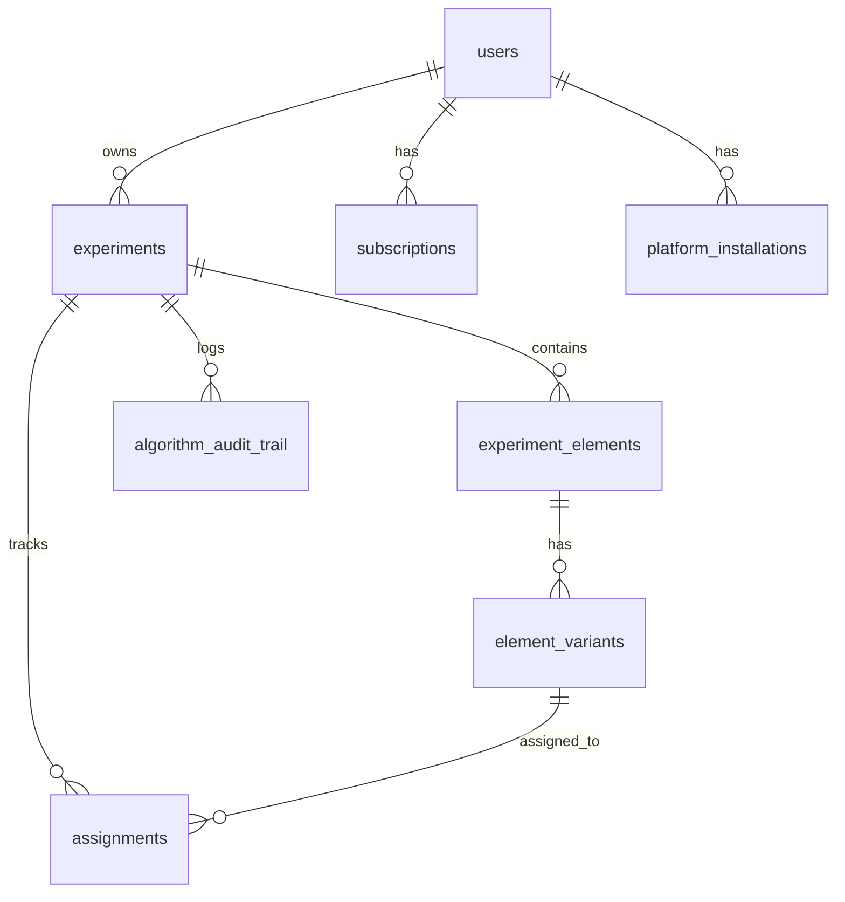

# Database Schema Documentation

## Overview
PostgreSQL database hosted on Supabase. Designed for realtime A/B testing experimentation platform.

---

## Core Tables

### `users`
| Column | Type | Description |
|--------|------|-------------|
| id | uuid (PK) | User ID |
| email | varchar (unique) | Email address |
| password_hash | varchar | Bcrypt hash |
| name | varchar | Display name |
| company | varchar? | Company name |
| role | varchar | 'admin' or 'client' |
| created_at | timestamptz | Registration date |

### `experiments`
| Column | Type | Description |
|--------|------|-------------|
| id | uuid (PK) | Experiment ID |
| user_id | uuid (FK→users) | Owner |
| name | varchar | Experiment name |
| description | text? | Description |
| target_url | varchar | URL where experiment runs |
| status | varchar | draft/active/paused/completed/archived |
| traffic_allocation | float | 0.0-1.0 |
| created_at | timestamptz | - |
| started_at | timestamptz? | When activated |

### `experiment_elements`
| Column | Type | Description |
|--------|------|-------------|
| id | uuid (PK) | Element ID |
| experiment_id | uuid (FK→experiments) | Parent experiment |
| name | varchar | Element name |
| selector_type | varchar | css/xpath/id/class |
| selector_value | varchar | CSS/XPath selector |
| fallback_selectors | jsonb | Backup selectors |
| element_type | varchar | text/button/headline/image |
| original_content | jsonb | Original content to replace |
| element_order | int | Display order |

### `element_variants`
| Column | Type | Description |
|--------|------|-------------|
| id | uuid (PK) | Variant ID |
| element_id | uuid (FK→experiment_elements) | Parent element |
| name | varchar | Variant name |
| content | jsonb | Variant content |
| algorithm_state | text | Encrypted Bayesian state |
| variant_order | int | Order |
| total_allocations | int | Times shown |
| total_conversions | int | Conversions |
| conversion_rate | float | Calculated rate |
| is_active | bool | Active flag |

### `assignments`
| Column | Type | Description |
|--------|------|-------------|
| id | uuid (PK) | Assignment ID |
| experiment_id | uuid (FK→experiments) | Experiment |
| variant_id | uuid (FK→element_variants) | Assigned variant |
| user_id | varchar | Visitor identifier |
| session_id | varchar? | Session |
| context | jsonb | Request context |
| assigned_at | timestamptz | Assignment time |
| converted_at | timestamptz? | Conversion time |
| conversion_value | float? | Value (default 1.0) |
| metadata | jsonb? | Extra data |

---

## Supporting Tables

### `leads` - Email capture
### `subscriptions` - Billing/plans
### `platform_installations` - SDK installations
### `user_onboarding` - Onboarding progress
### `algorithm_audit_trail` - Decision audit log
### `traffic_exclusion_rules` - Bot filtering

---

## Performance Indexes (Applied)

```sql
-- Covering indexes (avoid JOINs)
idx_elements_experiment_covering (experiment_id) INCLUDE (id, name, element_type)
idx_variants_element_covering (element_id) INCLUDE (allocations, conversions, rate)

-- Time-series (BRIN for efficient range queries)
idx_assignments_assigned_at_brin USING BRIN (assigned_at)

-- Partial indexes (common filters)
idx_experiments_active_only WHERE status = 'active'
idx_assignments_unconverted WHERE converted_at IS NULL
idx_variants_element_active WHERE is_active = true

-- Queue optimization
idx_leads_status_created (status, created_at DESC)
```

---

## Entity Relationships


